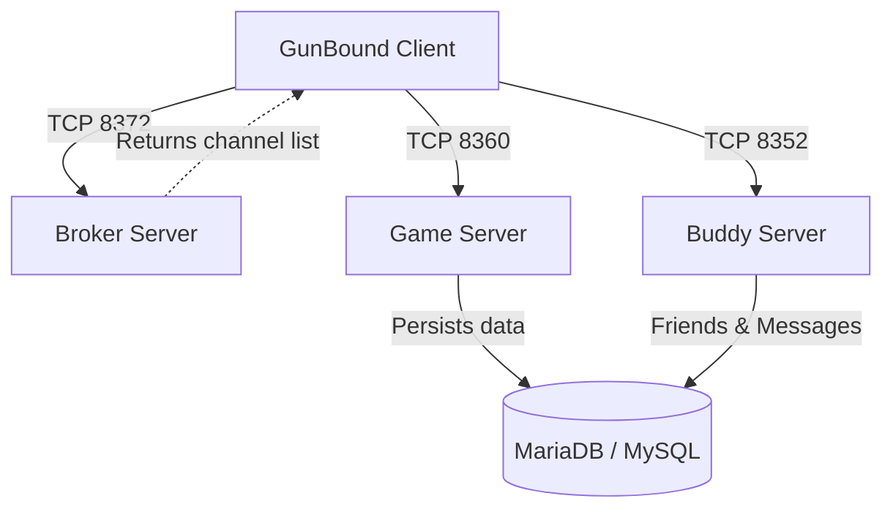
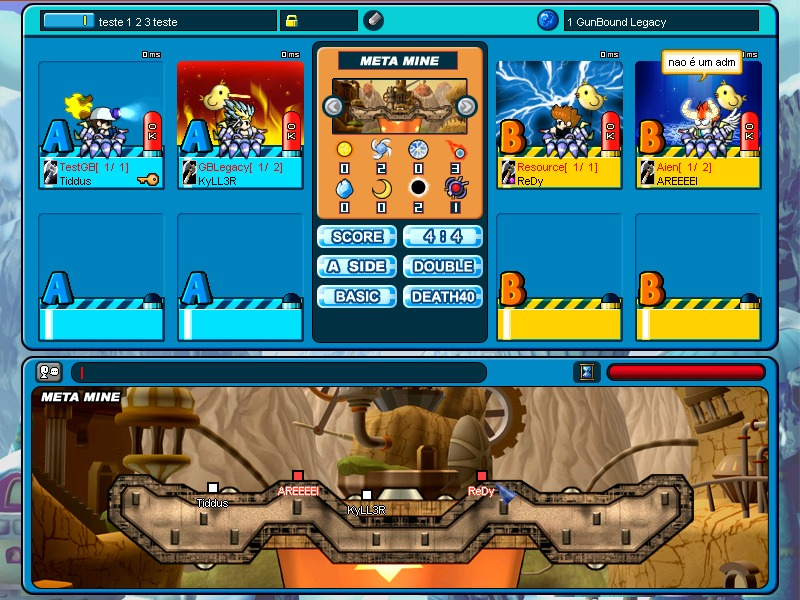
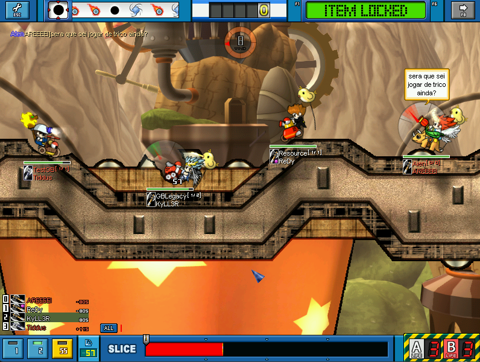
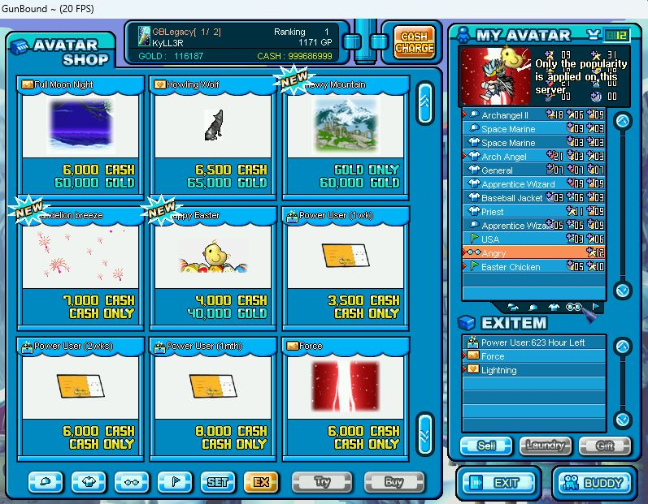

# GunBound Java Emulator - Thor's Hammer (Server Emulator)

This is a server emulator for the classic multiplayer online game **GunBound**, specifically targeting the **Thor's Hammer version (GIS v376 / GBS v404)** with **_Ex-Item_** and **_Power User_** support. Built with Java, it leverages the high-performance **Netty** networking framework to handle asynchronous, event-driven socket communication with game clients.

---

## 🏗️ System Architecture and Network Flow

The emulator is split into three independent server daemons cooperating to manage player sessions:



1. **Broker Server (GunBoundBrokerServer - Default Port: 8372)**:
   * The initial connection point for the client.
   * Handles commands `0x1013` (Broker Authentication Request) and `0x1100` (Server Directory Request).
   * Returns a dynamic list of active Game Servers (`0x1102`), detailing names, descriptions, IP addresses, ports, and real-time utilization.
2. **Game Server (GunBoundGameServer - Default Port: 8360)**:
   * The primary game daemon managing channels, lobbies, and game rooms.
   * Handles user authentication, channel chat, lobby synchronization, room lifecycle, map selection, tank (mobile) pick validation, Avatar Shop transactions, and live gameplay matches.
3. **Buddy Server (GunBoundBuddyServer - Default Port: TCP 8352)**:
   * Responsible for managing friend lists, instant messaging, active status tracking (online/offline), and the game's internal mail system (Buddy Mail).

---

## 🧠 Design Patterns and Technical Decisions

The emulator is designed to be highly scalable, thread-safe, and modular. The key architectural and design patterns used include:

### 1. Reactive & Non-Blocking Networking (Netty Pipeline)
* **Event-Driven Architecture**: Network I/O is processed asynchronously using Netty's `ChannelPipeline`.
* **Packet Framing (Decoding)**: Implemented in `PacketDecoder`, which intercepts the TCP stream and buffers incoming data until the full payload size (specified in the first 2 bytes as a little-endian short) is received before dispatching it to downstream handlers.
* **Idle State Detection**: An `IdleStateHandler` in the pipeline monitors channel inactivity (e.g., missing keep-alive packets) and gracefully closes inactive sockets, preventing resource leaks and zombie sessions.

### 2. Modern Concurrency Model
* **Java 21 Virtual Threads**: `GunBoundStarter` initiates the server instances using `Executors.newVirtualThreadPerTaskExecutor()`. This allows servers to run on lightweight virtual threads, drastically reducing operating system thread overhead.
* **Serialized Room Action Queue**:
  To prevent race conditions on shared game room states (such as concurrent HP updates, ready/unready state changes, or player actions) without blocking the main event loops or incurring heavy synchronization locks, each `GameRoom` operates an **Actor-like Message Queue**:
  - Actions are encapsulated into `Runnable` tasks.
  - Tasks are submitted to the room's task queue via `submitAction(Runnable, ChannelHandlerContext)`.
  - A thread-safe loop managed by an `AtomicBoolean` (`processing`) ensures that only one task from the queue is executed at a time, running on the client's respective Netty `EventLoop` thread.
* **Thread-Safe Data Structures**: Utilizes `ConcurrentHashMap` for maps containing player sessions and game states, and `PriorityBlockingQueue` to track and reuse vacant room slots (ensuring new players are always assigned the lowest available slot ID between 0 and 7).

### 3. Separation of Concerns in Packet Processing
* **Opcode Dispatcher Registry (Factory Pattern)**:
  `OpcodeReaderFactory` maps numeric command opcodes to functional execution blocks (`BiConsumer<ChannelHandlerContext, byte[]>`). This decoupled routing registry replaces massive conditional blocks (`if/else` ladders) and facilitates clean protocol extension.
* **Decoupled Readers & Writers**:
  - **Readers**: Classes under `packets.readers` extract and parse raw binary structures (`ByteBuf`), validate arguments, and delegate business actions to services or room controllers.
  - **Writers**: Classes under `packets.writers` are purely responsible for serializing Java objects and game states back into the protocol-compliant byte structures expected by the GunBound client.

### 4. Persistence and Data Access Architecture (DAO & Services)
* **HikariCP Connection Pooling**: Configured with production-grade parameters in `DatabaseManager` (2-minute keep-alive ping, `ConnectionTestQuery` set to `SELECT 1`, and a 30-minute maximum connection lifetime) to eliminate driver-level timeouts and "connection is closed" errors.
* **DAO Pattern (Data Access Object)**:
  - Persistent operations are declared in interface classes (e.g., `UserDAO`, `ChestDAO`, `StatsDAO`).
  - Raw SQL query generation and transactional updates are isolated inside JDBC implementation classes (e.g., `UserJDBC`, `ChestJDBC`).
  - Instantation and dependency injection are managed through the centralized `DAOFactory`.
* **Service Layer Pattern**:
  Classes (such as `UserServiceImpl` and `ShopServiceImpl`) decouple controllers and readers from direct database drivers, encapsulating the game rules (e.g., validating purchase conditions, calculating gold and GP updates).

---

## 🔐 GunBound Protocol Cryptography

A key component of the emulator is the handling of GunBound's custom binary security layers:

### Static Encryption
Used during the initial handshake, broker communication, and login phases. It uses AES-128 in ECB mode (`AES/ECB/NoPadding`) with a hardcoded static key:
`FF B3 B3 BE AE 97 AD 83 B9 61 0E 23 A4 3C 2E B0`

### Dynamic Encryption
Once a user is authenticated, the client and server transition to dynamic cryptography:
1. **Key Derivation**: The server derives a unique 128-bit key per session by concatenating the player's `username`, `password`, and a randomized 16-byte `authToken` generated during authentication.
2. **Custom SHA-0 Variant**: This concatenated string is hashed using a custom implementation of the **SHA-0** hashing algorithm.
3. **Truncation and Endian Swap**: The resulting 20-byte hash is truncated to 16 bytes. These bytes are then swapped in 4-byte blocks (little-endian word rotation) to form the final AES-128 key.
4. **Command Checksums**:
   - Outgoing dynamic payloads must align to 12-byte boundaries.
   - For every 12-byte payload chunk, the server prepends a 4-byte command checksum calculated as `0x8631607E + COMMAND_OPCODE`.
   - The final 16-byte blocks are then encrypted with the derived dynamic AES key. Upon receipt, the server decrypts the payload, validates the command checksum, and discards it to extract the original 12-byte segment.

### Sequence Validation (LCG)
To prevent packet replay attacks, the GunBound protocol uses a sequence checksum inside the 6-byte header, calculated dynamically based on the total bytes sent (`sumPacketLength`) using a Linear Congruential Generator (LCG):
$$\text{Sequence} = (((\text{sumPacketLength} \times \text{0x43FD}) \ \& \ \text{0xFFFF}) - \text{0x53FD}) \ \& \ \text{0xFFFF}$$
*The initial handshake packet uses a fixed seed value of `0xCBEB`.*

---

## 📁 Project Directory Structure

```
src/main/java/br/com/gunbound/emulator
│
├── GunBoundStarter.java          # Main server bootstrapper (spawns Broker, Game, and Buddy servers)
├── ServerConfig.java             # Singleton configuration loader for config.properties
├── ConnectionManager.java        # Core registry managing active Netty channels
│
├── broker/                       # Directory/Router Server (Broker)
│   ├── GunBoundBrokerServer.java
│   └── GunBoundBrokerServerHandler.java
│
├── buddy/                        # Social & Friend List Server (Buddy)
│   ├── GunBoundBuddyServer.java
│   ├── GunBundBuddyServerHandler.java
│   ├── config/                   # Buddy decoders and logging handlers
│   ├── db/
│   ├── entities/
│   └── packet/                   # Buddy packet readers and writers
│
├── db/                           # Database Manager & HikariCP Pool Configuration
│   ├── DatabaseManager.java      # Configures HikariCP datasources
│   └── DB.java
│
├── gameserver/                   # Core Game Logic Server
│   ├── GunBoundGameServer.java
│   ├── handlers/                 # Netty pipeline handlers for game server sockets
│   ├── lobby/                    # Channel, Lobby and chat coordination
│   ├── playdata/                 # Game assets metadata (maps, spawn points)
│   ├── packets/                  # Protocol routing, opcodes, and factory definitions
│   │   ├── OpcodeReaderFactory.java # Opcode command router registry
│   │   ├── readers/              # Message payload decoders (Login, Chat, Shop, Room settings)
│   │   └── writers/              # Binary response packet builders
│   └── room/                     # Match room logic
│       ├── GameRoom.java         # Room state controller & room-bound action queue
│       ├── RoomManager.java      # Singleton managing room allocations
│       └── onlymob/              # Restrictive mode implementations (e.g. Only Mob Commands)
│
├── model/                        # Data Entities & Persistence Layer (DAOs)
│   ├── entities/                 # Data transfer objects (User, Avatar, Chest, ServerOption)
│   └── DAO/                      # Data Access interfaces & JDBC implementations (impl)
│
├── services/                     # Business Logic Services (Shop, Users, Auth)
│   └── impl/                     # Service implementation layers
│
└── utils/                        # Utilities & Cryptographic helpers
    ├── crypto/
    │   └── GunBoundCipher.java   # Static/Dynamic cipher algorithms & SHA-0 implementation
    ├── PacketDecoder.java        # Netty ByteToMessageDecoder for packet sizes
    └── PacketUtils.java          # LCG Sequence generators, packet header assemblers
```

---

## 🛠️ Prerequisites

To build and run this emulator, ensure your development environment has:

* **Java Development Kit (JDK) 21** or higher (Required for Virtual Thread features).
* **Apache Maven 3.8** or higher.
* **MariaDB 10.4+** (or MySQL 8.0+).
* GunBound client files (Thor's Hammer edition, GIS v376 or GBS v404).

---

## ⚙️ Environment Setup

### 1. Database Setup
1. Create a new database schema in your database server (e.g., `gbth`).
2. Import the required SQL schema tables (`user`, `game`, `chest`, `menu`, etc.).

### 2. Configuration Properties
Create a folder named `config/` in your project's root directory, and create a file named `config.properties` inside it.

Configure the following mandatory keys:

```properties
# ===============================================
# GENERAL SERVER CONFIGURATIONS
# ===============================================
# Public IP of the server where the emulator will run.
# Use 127.0.0.1 for local testing.
server.public.ip=127.0.0.1

# ===============================================
# BROKER SERVER CONFIGURATIONS
# ===============================================
# Port that the Broker Server will use to accept initial connections.
broker.port=8372
broker.serv1.name=GunBound Legacy
broker.serv1.descr=Avatar OFF

# ===============================================
# GAME SERVER CONFIGURATIONS
# ===============================================
# Port that the main Game Server will use.
gameserver.port=8360

# Probability of getting Dragon/Knight (hidden tanks)
gameserver.tank.hidden.ratio=10
gameserver.goldfactor=100
gameserver.scorefactor=100
gameserver.stage0_probability=5

# Event settings
gameserver.eventtrigger=1
gameserver.eventactprop=50
# Honk (megaphone) price
gameserver.honkprice=10000
# Balloon (chat bubble) price
gameserver.balloonprice=50000
# Talk text color price
gameserver.colorprice=50000

# PowerUser settings
gameserver.superuseritem=204801

gameserver.channelment=#GunBound Legacy Thor's Hammer
gameserver.channeldaymsg=*Bom Dia
gameserver.channelafternoonmsg=*Boa Tarde
gameserver.channelnightmsg=*Boa Noite
gameserver.roomment=&Jogue Limpo!

gameserver.versionfirst=100
gameserver.versionlast=900
gameserver.passableauthority=0

gameserver.funcrestrict=1040384

# ===============================================
# BUDDY SERVER CONFIGURATIONS
# ===============================================
# TCP Port that the Buddy Server (friends system) will use.
buddy.port=8352
# UDP Port for the Buddy Server chat/presence service.
buddy.udp.port=8381

# Database Credentials
db.url=jdbc:mariadb://localhost:3306/gbth
db.user=your_db_username
db.password=your_db_password
db.useSSL=false
```

---

## 🚀 Running the Emulator

1. Open your terminal in the root directory of the repository.
2. Compile the application and download dependencies using Maven:
   ```bash
   mvn clean install
   ```
3. Run the compiled application via the bootsrapper class:
   ```bash
   mvn exec:java -Dexec.mainClass="br.com.gunbound.emulator.GunBoundStarter"
   ```
4. If configured correctly, startup logs will output the HikariCP connection pool initializing, followed by confirmation messages for the Broker, Game, and Buddy servers listening on their respective ports.

---

## 🤝 Contributing

Contributions are welcome! To contribute:

1. **Fork** this repository.
2. Create your feature branch:
   ```bash
   git checkout -b feature/MyNewFeature
   ```
3. Commit your changes with clear descriptions:
   ```bash
   git commit -m 'feat: add guild chat support'
   ```
4. Push to your branch:
   ```bash
   git push origin feature/MyNewFeature
   ```
5. Submit a **Pull Request**.

---

## 🎖️ Credits, Support and Tributes

### Credits: KyLL3R
**Special Thanks:** ChoVinisTa, Tiddus, Jglim, Rizzo

### External Plugins
* **Rizzo** - Developer of the support library: [GunBound Thor's Hammer Lib (DLL)](https://github.com/samuelrizzo/gunbound-th-plugin-dll). Special thanks for THv404 DLL!

### Modern Client
* **Jglim** - Developer of the support library: [GunBound Thor's Hammer Modern Client](https://github.com/jglim/ThorsHammer).

### 🕯️ Special Tribute (In Memoriam)
* **JoBaS (Joabe Rodrigues)**

---

### Screenshots





GunBound was more than just a game for many of us it was a part of our childhood and a community that created unforgettable memories.

I hope that one day Softnyx will entrust the future of GunBound to the right people, allowing its golden days to shine once again.

## 📜 License and Disclaimers

This project is licensed under the **MIT License**. See [LICENSE.txt](LICENSE.txt) for license text.

> [!WARNING]
> **Legal Disclaimer:** The GunBound game client and all associated artwork, assets, and trademarks are the exclusive property of **Softnyx**. This server emulator is a non-commercial, community-driven project created strictly for educational, research, and software preservation purposes.